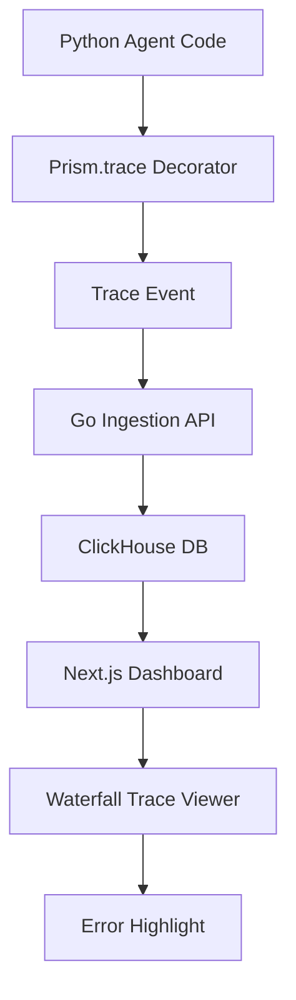

# PrismTrace: Datadog for Multi-Agent AI

PrismTrace is a universal control plane for multi-agent AI systems, providing instant observability and debugging across agent workflows. With a single decorator (`@Prism.trace`), developers gain a glass-box view into their entire agent fleet, reducing debugging time from days to minutes.

## Key Features
- **One-line integration:** Add `@Prism.trace` to agent code.
- **Unified trace visualization:** Waterfall view of agent call graphs, even across protocols.
- **Error pinpointing:** Instantly see which agent failed and why.
- **Protocol-agnostic:** Designed for MCP (developer standard), with clear path to A2A (enterprise standard).

## System Design & Data Model
- **Trace:** Unique ID, root span, timestamps, status
- **Span:** Unique ID, parent span, agent name, timestamps, status, error
- **Error:** Type, message, stack trace
- **API:** POST /api/trace with trace and spans
- **DB:** ClickHouse tables for traces and spans

## Demo Workflow



## Example: Mock Multi-Agent System

```python
from prismtrace import trace

@trace
def parent_agent():
    child_agent_1()
    child_agent_2()

@trace
def child_agent_1():
    # Simulate success
    pass

@trace
def child_agent_2():
    # Simulate failure
    raise Exception("Subagent failed")

if __name__ == "__main__":
    try:
        parent_agent()
    except Exception as e:
        print(f"Workflow failed: {e}")
```

## MVP Path
- **Python SDK:** Minimal decorator for tracing agent calls.
- **Go Ingestion API:** REST endpoint for trace events.
- **ClickHouse DB:** Store and query traces.
- **Next.js Frontend:** Waterfall trace viewer.

---
PrismTrace is designed for rapid developer adoption and seamless expansion to enterprise standards. The MVP delivers the "magic moment" of instant clarity for agent debugging, with a clear path to full protocol support and advanced governance features.
