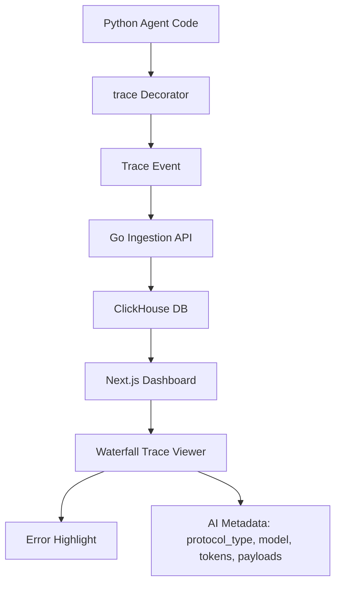

# PrismTrace: Datadog for Multi-Agent AI

PrismTrace is a universal control plane for multi-agent AI systems, providing instant observability and debugging across agent workflows. With a single decorator (`@trace`), developers gain a glass-box view into their entire agent fleet, reducing debugging time from days to minutes.

## Key Features
- **One-line integration:** Add `@trace` to agent code.
- **Unified trace visualization:** Waterfall view of agent call graphs, even across protocols.
- **Error pinpointing:** Instantly see which agent failed and why.
- **Protocol-agnostic:** Designed for MCP (developer standard), with clear path to A2A (enterprise standard).

## Quick Start

### 1. Run the Multi-Agent Demo
The `demo.py` file contains a mock multi-agent system that simulates calls to Gemini and Groq (or fails manually). By running this script, you will see trace output directly in your console.

```bash
# Export your API keys if you want real LLM calls (optional)
export GEMINI_API_KEY="your_api_key"
export GROQ_API_KEY="your_api_key"

# Run the demo script
PYTHONPATH=. python demo.py
```

### 2. View Traces in the Dashboard
The Next.js dashboard provides a visual, waterfall representation of trace data. In the current MVP, it uses a preloaded static `demo-trace.json` file.

```bash
cd dashboard
npm install
npm run dev
```

Open [http://localhost:3000](http://localhost:3000) to interact with the trace viewer. You can click on nodes to see detailed payload, model info, token usage, and errors.

## System Design & Data Model
- **Trace:** Unique ID, root span, timestamps, status
- **Span:** Unique ID, parent span, agent name, timestamps, status, error
- **Error:** Type, message, stack trace
- **AI Metadata:** protocol_type, llm_model_name, token_counts, input/output payloads
- **API:** POST /api/trace with trace and spans (planned)
- **DB:** ClickHouse tables for traces and spans (planned)

## Demo Workflow



## Example: Mock Multi-Agent System

```python
from prismtrace.decorator import trace

@trace
def parent_agent():
    child_agent_1()
    child_agent_2()

@trace
def child_agent_1():
    # Simulate success
    pass

@trace
def child_agent_2():
    # Simulate failure
    raise Exception("Subagent failed")

if __name__ == "__main__":
    try:
        parent_agent()
    except Exception as e:
        print(f"Workflow failed: {e}")
```

## MVP Path
- **Python SDK:** Minimal decorator for tracing agent calls.
- **Next.js Frontend:** Interactive node-based workflow and waterfall trace viewer.
- **Go Ingestion API:** REST endpoint for trace events (in progress).
- **ClickHouse DB:** Store and query traces (in progress).

## Path to Production Readiness
PrismTrace MVP demonstrates core tracing and debugging for agent workflows. For full production use in multi-agent systems, the following enhancements are planned:
- Aggregate all spans from a workflow under a single `trace_id`.
- Build a call graph by setting `parent_span_id` correctly for each span.
- Send trace events to a real backend (Go API) and store in ClickHouse DB.
- Handle concurrency, distributed workflows, and large-scale data.
- Integrate with real agent frameworks and LLM APIs.
- Add support for async/concurrent agent calls.

---
PrismTrace is designed for rapid developer adoption and seamless expansion to enterprise standards. The MVP delivers the "magic moment" of instant clarity for agent debugging, with a clear path to full protocol support and advanced governance features.